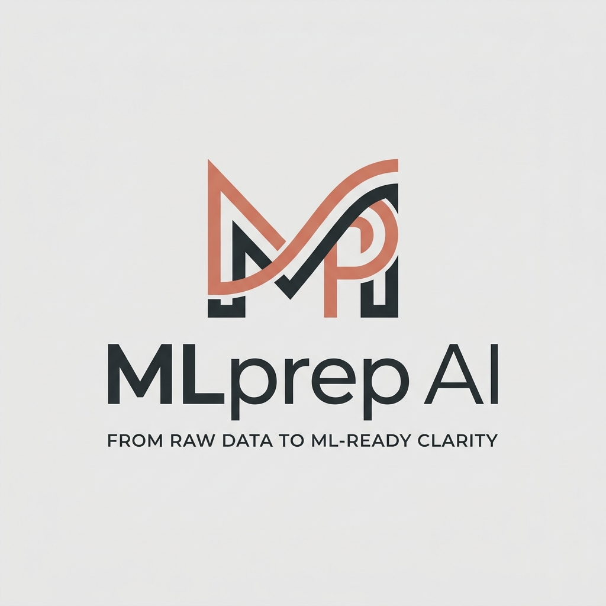

<div align="center">



# MLPrep AI

### AI-Powered Data Analyst & ML Preparation Suite

*Chat with your data. Visualize insights. Prepare for machine learning — all in one platform.*

[](https://mlprep-ai.vercel.app)
[](https://ai-data-analyst-backend-ni2l.onrender.com)
[](LICENSE)
[](https://python.org)
[](https://react.dev)

</div>

---

## 📖 Table of Contents

- [Overview](#-overview)
- [Live Architecture](#-live-architecture)
- [Agent Orchestration System](#-agent-orchestration-system)
  - [The LangGraph Pipeline](#the-langgraph-pipeline)
  - [Agent Nodes](#agent-nodes)
  - [Intent Classification & Routing](#intent-classification--routing)
  - [Multi-Model LLM Router](#multi-model-llm-router)
  - [Checkpointer / Memory Layer](#checkpointer--memory-layer)
- [Feature Set](#-feature-set)
- [Tech Stack](#-tech-stack)
- [Project Structure](#-project-structure)
- [Getting Started (Local Dev)](#-getting-started-local-dev)
- [Docker Compose (Full Stack)](#-docker-compose-full-stack)
- [Environment Variables](#-environment-variables)
- [API Reference](#-api-reference)
- [Deployment](#-deployment)
- [Observability & Tracing](#-observability--tracing)
- [Security](#-security)
- [Roadmap](#-roadmap)

---

## 🌟 Overview

**MLPrep AI** is a full-stack, production-grade AI data analysis platform that combines a **multi-agent LangGraph orchestration backend** with a **React SPA frontend**. Users upload CSV/Excel/JSON datasets and interact with them using natural language — the AI agents write, execute, and self-correct pandas code, generate interactive Vega-Lite charts, assess data quality, score ML readiness, and narrate data stories, all without writing a single line of code.

### Key Highlights

| Capability | Details |
|---|---|
| 🤖 **Agentic Pipeline** | LangGraph StateGraph with 7 specialist agent nodes |
| 🧠 **Dual-LLM Routing** | Fast model for classification, Smart model for code generation |
| 💾 **Persistent Memory** | PostgreSQL or Firestore checkpointer for multi-turn chat history |
| 🔒 **Auth-Gated API** | Firebase ID token verification on every endpoint |
| 📊 **Live Charts** | Auto-generated Vega-Lite specifications rendered interactively |
| 🛡️ **Self-Healing Code** | Analyst node retries up to 3× with LLM-powered auto-fix |
| 🗂️ **Dataset Registry** | Persistent Parquet-based storage with named dataset management |
| 📱 **Responsive UI** | Fully mobile-optimised React SPA with bottom navigation |

---

## 🏗️ Live Architecture

```
┌─────────────────────────────────────────────────────────────────┐
│                        CLIENT LAYER                             │
│  React 18 + Vite SPA  ←→  Firebase Auth (ID Token JWT)         │
│  Hosted on: Vercel / Netlify                                    │
└───────────────────────────────┬─────────────────────────────────┘
                                │  HTTPS + Bearer Token
                                ▼
┌─────────────────────────────────────────────────────────────────┐
│                       API GATEWAY LAYER                         │
│  FastAPI (Python 3.11) + Gunicorn + Uvicorn Workers             │
│  Hosted on: Render (Docker container)                           │
│  Auth Middleware → Firebase Admin SDK token verification        │
└───────────────────────────────┬─────────────────────────────────┘
                                │
                                ▼
┌─────────────────────────────────────────────────────────────────┐
│                  AGENT ORCHESTRATION LAYER                      │
│                                                                 │
│   ┌─────────────────────────────────────────────────────────┐  │
│   │              LangGraph StateGraph                        │  │
│   │                                                         │  │
│   │   question ──► [Orchestrator] ──► route_intent          │  │
│   │                     │                                   │  │
│   │         ┌───────────┼────────────────────┐             │  │
│   │         ▼           ▼                    ▼             │  │
│   │    [Analyst]   [Profiler]          [Quality]            │  │
│   │         │           │                    │             │  │
│   │    ┌────┴────┐       └──── END     [ML Readiness]       │  │
│   │    ▼         ▼                          │              │  │
│   │ [Visualizer] [Insights]           ──── END             │  │
│   │    │            │                                      │  │
│   │   END          END                                     │  │
│   └─────────────────────────────────────────────────────────┘  │
│                                                                 │
│   Separate Dedicated Agents (outside main graph):              │
│   • Cleaning Agent (AI Planner + Executor)                     │
│   • Explanation Agent                                          │
│   • Visualization Agent (standalone)                           │
│   • Story Narrator Agent                                       │
└───────────┬───────────────────────────────────┬────────────────┘
            │                                   │
            ▼                                   ▼
┌───────────────────┐               ┌───────────────────────────┐
│  LLM PROVIDERS    │               │   PERSISTENCE LAYER        │
│                   │               │                           │
│  • Groq API       │               │  • Firestore (Checkpointer │
│    (Llama 3.3 70B)│               │    — chat thread memory)  │
│  • Google GenAI   │               │  • PostgreSQL (Alt store) │
│    (Gemini Flash) │               │  • Parquet Files on Disk  │
│                   │               │    (dataset storage)      │
└───────────────────┘               └───────────────────────────┘
```

---

## 🤖 Agent Orchestration System

### The LangGraph Pipeline

The backend uses **LangGraph** (`langgraph==0.2.16`) to build a **compiled StateGraph** — a directed graph of specialist agent nodes connected by conditional routing edges. All state flows through a shared `AgentState` TypedDict:

```python
class AgentState(TypedDict):
    session_id: str          # Links to the user's dataset
    question: str            # The user's natural language question
    chat_history: list       # Multi-turn conversation context
    df_path: str             # Path to the Parquet dataset file
    intent: str              # Classified intent (routing key)
    persona: str             # general | finance | marketing | engineering
    pandas_code: str         # Generated Python code
    analysis_result: Any     # JSON-serialisable query result
    vega_spec: dict          # Auto-generated Vega-Lite chart spec
    insights: str            # LLM-narrated insights text
    suggested_questions: list # 3 contextual follow-up questions
    profiling_result: dict   # Dataset profile statistics
    quality_result: dict     # Data quality audit results
    ml_readiness_result: dict # ML readiness scoring
    ...
```

### Agent Nodes

| Node | File | Role |
|---|---|---|
| **Orchestrator** | `graph/nodes/orchestrator.py` | Classifies user intent via LLM + keyword fallback. Detects ambiguity and triggers clarification. Compresses schema to relevant columns before prompting. |
| **Analyst** | `graph/nodes/analyst.py` | Generates pandas code using the "smart" LLM. Executes in a hardened sandbox. Self-corrects up to **3 attempts** using error messages as feedback. |
| **Visualizer** | `graph/nodes/visualizer.py` | Produces a **Vega-Lite JSON spec** from the analyst result. Falls back to rule-based chart selection if LLM fails. |
| **Insights Generator** | `graph/nodes/insights.py` | Narrates the analysis result as a business insight using the smart LLM. Generates 3 contextual follow-up questions. |
| **Profiler** | `graph/nodes/profiler.py` | Computes column statistics (dtype, cardinality, null count, sample values) without writing code — direct Pandas operations. |
| **Quality** | `graph/nodes/quality.py` | Audits missing values, duplicates, outliers, class imbalance, and cardinality issues. |
| **ML Readiness** | `graph/nodes/ml_readiness.py` | Scores dataset features for ML suitability (0–100). Identifies target candidates, problematic columns, and preprocessing recommendations. |

**Standalone agents** (dedicated routers, not in the main graph):

| Agent | Router File | Description |
|---|---|---|
| **AI Cleaning Planner** | `routers/cleaning.py` | Two-phase: Plan generation (LLM produces a JSON cleaning plan) + Step-by-step execution with progress streaming |
| **AI Explainer** | `routers/explanation.py` | Explains any concept, code, or data pattern in natural language |
| **AI Visualizer** | `routers/visualization.py` | Standalone chart generation from natural language descriptions |
| **Data Story** | `routers/story.py` | Generates a full narrative data story with sections, insights, and chart suggestions |
| **AI Copilot** | `routers/chat_copilot.py` | Persistent conversational interface backed by Firestore threads |

### Intent Classification & Routing

The **Orchestrator** is the entry point of every LangGraph run. It classifies each question into one of 6 intents:

```
analysis_only           → Analyst → END
analysis_and_visualization → Analyst → Visualizer → END
insights                → Analyst → Insights Generator → END
profiling               → Profiler → END
quality_check           → Quality → ML Readiness → END
cleaning_report         → (routed to dedicated cleaning router, bypasses graph)
clarification           → Returns a clarifying question to the user
```

Classification uses a **two-tier strategy**:
1. **LLM call** (fast model) with a structured JSON prompt → parsed for `intent` field
2. **Keyword fallback** if LLM fails or returns invalid JSON

### Multi-Model LLM Router

The system uses a **tiered LLM architecture** configured via environment variables:

```
FAST tier  → Intent classification, summaries, insights narration
SMART tier → Pandas code generation, Vega-Lite spec generation, complex reasoning
```

| Variable | Default | Purpose |
|---|---|---|
| `FAST_PROVIDER` | `google` | Provider for fast model |
| `FAST_MODEL` | `gemini-1.5-flash` | Model for classification |
| `SMART_PROVIDER` | `groq` | Provider for smart model |
| `SMART_MODEL` | `llama-3.3-70b-versatile` | Model for code generation |

Supported providers: **Groq** (`langchain-groq`) and **Google GenAI** (`langchain-google-genai`). The factory (`utils/llm_factory.py`) gracefully degrades to keyword-only mode if no API keys are configured.

### Checkpointer / Memory Layer

LangGraph **checkpointers** persist the full graph state between runs, enabling multi-turn conversation memory:

| Checkpointer | When Used | Description |
|---|---|---|
| `PostgresSaver` | `DATABASE_URL` is set | Production — persistent, scalable, survives restarts |
| `FirestoreSaver` | `FIREBASE_PROJECT_ID` is set | Cloud-native — Google Firestore via `langgraph-checkpoint-firestore` |
| `MemorySaver` | Neither set | Development only — in-process, ephemeral |

The chat copilot router uses Firestore directly to persist `threads` collections for per-user conversation history.

---

## ✨ Feature Set

### 🤖 AI Copilot Chat
- Natural language Q&A against any uploaded dataset
- Multi-turn memory via LangGraph + Firestore thread persistence
- 4 analyst personas: **General**, **Finance**, **Marketing**, **Engineering**
- Smart context-aware follow-up question suggestions
- Developer mode: inspect generated pandas code
- Session recovery banner when backend restarts

### 📊 AI Visualizer
- Auto-generates **Vega-Lite** interactive charts from natural language
- Chart types: bar, line, scatter, histogram, boxplot, heatmap, area
- Schema-aware — picks appropriate columns automatically
- Rendered interactively in-browser via `react-vega`

### 🔍 Data Profiler
- Column-by-column statistics: dtype, cardinality, null %, min/max/mean
- Sample values preview
- Memory usage and shape summary

### 🛡️ Quality Check
- Missing value audit with percentage and fill recommendations
- Duplicate row detection
- Outlier detection (IQR + Z-score)
- Class imbalance analysis for categorical columns
- High-cardinality column warnings

### 🤖 ML Readiness Scorer
- Per-feature ML suitability scoring (0–100)
- Target column candidate identification
- Preprocessing recommendations (encoding, scaling, imputation)
- Overall dataset ML readiness score

### 🧹 AI Data Cleaner
- **Cleaning Planner**: LLM generates a stepwise JSON cleaning plan
- **Cleaning Executor**: Applies each step and streams progress
- Operations: drop nulls, fill nulls, remove duplicates, encode categoricals, clip outliers, rename columns, drop columns, type conversion
- Download cleaned dataset as CSV

### 📖 Data Story
- Full narrative report generated from dataset statistics
- Sections: Summary, Key Findings, Data Quality, Recommendations
- Chart suggestions embedded in the story

### 💡 AI Insights
- Business-focused insight narration from query results
- Context-aware based on analyst persona
- Powered by the "smart" LLM tier

### 🗂️ Dataset Registry
- Upload CSV, Excel (.xlsx), JSON
- Import from **Kaggle** via dataset URL
- Import from any public HTTP URL
- Named dataset storage with persistent Parquet files
- Multi-dataset management (activate, delete, switch)
- Auto-activation of single datasets on login

---

## 🛠️ Tech Stack

### Backend

| Layer | Technology | Version |
|---|---|---|
| **Web Framework** | FastAPI | 0.115.0 |
| **ASGI Server** | Uvicorn + Gunicorn | 0.30.6 / 22.0.0 |
| **Agent Orchestration** | LangGraph | 0.2.16 |
| **LLM Framework** | LangChain Core | 0.2.38 |
| **LLM — Groq** | langchain-groq | 0.1.9 |
| **LLM — Google** | langchain-google-genai | 1.0.10 |
| **Data Processing** | Pandas + NumPy + PyArrow | 2.1.4 / 1.26.4 / 17.0.0 |
| **State Persistence** | langgraph-checkpoint-postgres | 1.0.1 |
| **State Persistence** | langgraph-checkpoint-firestore | 0.1.7 |
| **Auth (Backend)** | Firebase Admin SDK | 7.4.0 |
| **Database** | PostgreSQL 15 (via psycopg3 + pool) | 3.2.1 |
| **Error Monitoring** | Sentry SDK | 2.4.0 |
| **Dataset Imports** | Kaggle API | 2.2.2 |
| **Containerisation** | Docker + Docker Compose | — |

### Frontend

| Layer | Technology | Version |
|---|---|---|
| **Framework** | React | 18 |
| **Build Tool** | Vite | 5 |
| **Auth (Client)** | Firebase Auth | 10 |
| **Charts** | react-vega + Vega-Lite | — |
| **Icons** | Lucide React | — |
| **HTTP Client** | Axios (via custom API client) | — |
| **Styling** | Vanilla CSS (custom design system) | — |
| **Font** | Source Serif 4 + Inter + JetBrains Mono | — |

### Infrastructure

| Service | Role |
|---|---|
| **Vercel** | Frontend SPA hosting (with SPA rewrite rules) |
| **Render** | Backend Docker container hosting with persistent disk |
| **Firebase Auth** | User authentication (Email/Password + Google) |
| **Firestore** | LangGraph chat thread checkpointer + copilot history |
| **PostgreSQL** | Alternative LangGraph checkpointer (Docker Compose) |
| **GitHub** | Source control + CI/CD trigger for Render & Vercel |

---

## 📁 Project Structure

```
data-analyst-agent/
├── backend/                        # FastAPI + LangGraph backend
│   ├── agents/
│   │   └── cleaner.py              # Standalone AI data cleaning agent
│   ├── graph/                      # LangGraph orchestration
│   │   ├── graph.py                # StateGraph builder + checkpointer init
│   │   ├── state.py                # AgentState TypedDict definition
│   │   └── nodes/                  # Individual agent nodes
│   │       ├── orchestrator.py     # Intent classifier (entry point)
│   │       ├── analyst.py          # Pandas code gen + self-correction
│   │       ├── visualizer.py       # Vega-Lite chart generator
│   │       ├── insights.py         # Business insight narrator
│   │       ├── profiler.py         # Dataset profiling node
│   │       ├── quality.py          # Data quality audit node
│   │       └── ml_readiness.py     # ML readiness scorer node
│   ├── routers/                    # FastAPI route handlers (16 routers)
│   │   ├── chat.py                 # Core Q&A chat endpoint
│   │   ├── chat_copilot.py         # Persistent AI Copilot (Firestore threads)
│   │   ├── upload.py               # Dataset upload handler
│   │   ├── datasets.py             # Dataset registry CRUD
│   │   ├── imports.py              # Kaggle + URL import
│   │   ├── cleaning.py             # AI cleaning planner + executor
│   │   ├── explanation.py          # AI explainer
│   │   ├── visualization.py        # Standalone AI visualizer
│   │   ├── story.py                # Data story generator
│   │   ├── insights.py             # AI insights endpoint
│   │   ├── profiling.py            # Profiling endpoint
│   │   ├── traces.py               # Trace/observability log viewer
│   │   └── ...                     # Additional routers
│   ├── tools/                      # Execution tools used by nodes
│   │   ├── pandas_tool.py          # Hardened sandbox + result serialiser
│   │   ├── vegalite_tool.py        # Vega-Lite spec generator
│   │   ├── quality_tool.py         # Quality audit implementations
│   │   ├── ml_readiness_tool.py    # ML scoring implementations
│   │   ├── profiler_tool.py        # Profiling stat computations
│   │   ├── cleaning_executor.py    # Cleaning operation executor
│   │   └── cleaning_planner.py     # Cleaning plan generator
│   ├── utils/                      # Shared utilities
│   │   ├── llm_factory.py          # Multi-model LLM router
│   │   ├── tracer.py               # Request tracing / observability
│   │   ├── compressor.py           # Schema compression (relevant cols)
│   │   ├── prompts.py              # All LLM prompt templates
│   │   └── logging_config.py       # Structured JSON logging
│   ├── config/
│   │   └── settings.py             # Pydantic settings (env vars)
│   ├── main.py                     # FastAPI app, middleware, lifespan
│   ├── Dockerfile                  # Production Docker image
│   ├── gunicorn_conf.py            # Gunicorn worker configuration
│   └── requirements.txt
│
├── frontend/                       # React + Vite SPA
│   ├── src/
│   │   ├── App.jsx                 # Root component + page routing
│   │   ├── index.css               # Full design system (CSS custom props)
│   │   ├── components/             # UI components (23 components)
│   │   │   ├── Layout.jsx          # App shell (sidebar, topbar, bottom nav)
│   │   │   ├── ChatInterface.jsx   # AI Copilot chat UI
│   │   │   ├── MessageBubble.jsx   # Chat message renderer
│   │   │   ├── FileUpload.jsx      # Dataset upload + import UI
│   │   │   ├── DatasetManagement.jsx # Dataset registry page
│   │   │   ├── VegaChart.jsx       # Vega-Lite chart renderer
│   │   │   ├── DataQuality.jsx     # Quality check page
│   │   │   ├── MLReadiness.jsx     # ML readiness page
│   │   │   ├── DatasetProfile.jsx  # Data profile page
│   │   │   ├── StoryPanel.jsx      # Data story page
│   │   │   ├── CleaningPanel.jsx   # AI cleaner UI
│   │   │   ├── CleaningPlannerPage.jsx # AI planner UI
│   │   │   ├── InsightPanel.jsx    # AI insights page
│   │   │   ├── ExplanationPanel.jsx # AI explainer page
│   │   │   ├── VisualizationPanel.jsx # AI visualizer page
│   │   │   ├── TraceViewer.jsx     # Observability trace inspector
│   │   │   ├── AuthPage.jsx        # Login / signup page
│   │   │   └── LLMConfigModal.jsx  # Per-session LLM model switcher
│   │   ├── hooks/                  # Custom React hooks
│   │   │   ├── useAuth.jsx         # Firebase Auth context provider
│   │   │   ├── useChat.js          # Chat state + send question logic
│   │   │   └── useSession.js       # Dataset session lifecycle
│   │   ├── services/
│   │   │   └── mlApi.js            # All API call functions
│   │   └── api/
│   │       └── client.js           # Axios instance with auth interceptor
│   ├── public/
│   │   ├── logo.png
│   │   └── vercel.json             # SPA rewrite rules (copied to dist/)
│   ├── vercel.json                 # Vercel deployment configuration
│   ├── Dockerfile                  # Nginx-based production container
│   ├── nginx.conf                  # Nginx SPA fallback config
│   └── vite.config.js
│
├── docker-compose.yml              # Full-stack local Docker setup
├── docs/
│   └── deployment_guide.md        # Cloud deployment walkthrough
└── vercel.json                     # Root-level Vercel config
```

---

## 🚀 Getting Started (Local Dev)

### Prerequisites

- **Python 3.11+**
- **Node.js 18+** and npm
- A **Groq API key** (free at [console.groq.com](https://console.groq.com)) and/or **Google API key**

### 1. Clone the Repository

```bash
git clone https://github.com/07pavan/MLprep_ai.git
cd MLprep_ai
```

### 2. Backend Setup

```bash
cd backend

# Create and activate virtual environment
python -m venv venv
source venv/bin/activate          # Linux/macOS
# venv\Scripts\activate           # Windows

# Install dependencies
pip install -r requirements.txt

# Configure environment
cp .env.example .env
# Edit .env — set GROQ_API_KEY and/or GOOGLE_API_KEY at minimum
```

**.env** (minimum for local development):
```env
GROQ_API_KEY=gsk_your_key_here
FAST_MODEL=gemini-1.5-flash
FAST_PROVIDER=google
GOOGLE_API_KEY=your_google_key_here
SMART_MODEL=llama-3.3-70b-versatile
SMART_PROVIDER=groq
STORAGE_DIR=storage
CORS_ORIGINS=["http://localhost:5173"]
```

```bash
# Start the backend
uvicorn main:app --reload --port 8000
```

Backend will be available at `http://localhost:8000`. Health check: `GET /health`

### 3. Frontend Setup

```bash
cd frontend

# Install dependencies
npm install

# Configure environment
cp .env.example .env.local
# Edit .env.local — set VITE_API_URL and Firebase keys
```

**.env.local** (minimum for local development):
```env
VITE_API_URL=http://localhost:8000
# Firebase keys are required for auth — see docs/deployment_guide.md Step 1
VITE_FIREBASE_API_KEY=your_firebase_api_key
VITE_FIREBASE_AUTH_DOMAIN=your-project.firebaseapp.com
VITE_FIREBASE_PROJECT_ID=your-project-id
VITE_FIREBASE_STORAGE_BUCKET=your-project.appspot.com
VITE_FIREBASE_MESSAGING_SENDER_ID=123456789
VITE_FIREBASE_APP_ID=1:123456789:web:abcdef
```

```bash
# Start the development server
npm run dev
```

Frontend will be available at `http://localhost:5173`.

---

## 🐳 Docker Compose (Full Stack)

Run the complete stack (backend + frontend + PostgreSQL) with a single command:

```bash
# From the repo root
cp backend/.env.example .env
# Edit .env — add your LLM API keys

docker-compose up --build
```

| Service | Port | Description |
|---|---|---|
| `analyst-backend` | `8000` | FastAPI backend |
| `analyst-frontend` | `80` | Nginx-served React SPA |
| `analyst-postgres` | `5432` | PostgreSQL checkpointer DB |

The Docker Compose setup automatically:
- Connects the backend to PostgreSQL for persistent LangGraph state
- Mounts a named volume for dataset storage (`/app/storage`)
- Waits for PostgreSQL health checks before starting the backend

---

## 🔧 Environment Variables

### Backend (`backend/.env`)

| Variable | Required | Default | Description |
|---|---|---|---|
| `GROQ_API_KEY` | ✓* | — | Groq API key for LLM calls |
| `GOOGLE_API_KEY` | ✓* | — | Google API key for Gemini models |
| `FAST_MODEL` | — | `gemini-1.5-flash` | Model used for intent classification |
| `FAST_PROVIDER` | — | `google` | Provider for fast model (`google` or `groq`) |
| `SMART_MODEL` | — | `llama-3.3-70b-versatile` | Model for code generation |
| `SMART_PROVIDER` | — | `groq` | Provider for smart model |
| `TEMPERATURE` | — | `0.1` | LLM temperature |
| `LLM_TIMEOUT` | — | `30` | LLM request timeout (seconds) |
| `STORAGE_DIR` | — | `storage` | Path for Parquet dataset files |
| `MAX_FILE_SIZE_MB` | — | `100` | Max upload file size |
| `CORS_ORIGINS` | — | `["http://localhost:5173"]` | Allowed frontend origins |
| `DATABASE_URL` | — | — | PostgreSQL connection string (enables PostgresSaver) |
| `FIREBASE_PROJECT_ID` | — | — | Firebase project ID (enables FirestoreSaver + auth) |
| `FIREBASE_SERVICE_ACCOUNT_JSON` | — | — | Base64-encoded service account JSON |
| `ENABLE_AUTH` | — | `false` | Enforce Firebase token verification |
| `SENTRY_DSN` | — | — | Sentry DSN for error monitoring |

\* At least one LLM key is required. System degrades to keyword-only mode without them.

### Frontend (`frontend/.env.local`)

| Variable | Required | Description |
|---|---|---|
| `VITE_API_URL` | ✓ | Backend base URL |
| `VITE_FIREBASE_API_KEY` | ✓ | Firebase web API key |
| `VITE_FIREBASE_AUTH_DOMAIN` | ✓ | Firebase auth domain |
| `VITE_FIREBASE_PROJECT_ID` | ✓ | Firebase project ID |
| `VITE_FIREBASE_STORAGE_BUCKET` | ✓ | Firebase storage bucket |
| `VITE_FIREBASE_MESSAGING_SENDER_ID` | ✓ | Firebase messaging sender ID |
| `VITE_FIREBASE_APP_ID` | ✓ | Firebase app ID |

---

## 📡 API Reference

All endpoints require `Authorization: Bearer <firebase_id_token>` when `ENABLE_AUTH=true`.

### Core Chat

| Method | Endpoint | Description |
|---|---|---|
| `POST` | `/api/chat` | Run a question through the LangGraph pipeline |
| `POST` | `/api/chat/copilot` | Persistent Copilot (Firestore thread memory) |

### Dataset Management

| Method | Endpoint | Description |
|---|---|---|
| `POST` | `/api/upload` | Upload a CSV/Excel/JSON file |
| `POST` | `/api/import` | Import from Kaggle or public URL |
| `GET` | `/api/datasets` | List all user datasets |
| `POST` | `/api/datasets/{id}/activate` | Activate a saved dataset |
| `DELETE` | `/api/datasets/{id}` | Delete a dataset |

### Analysis Endpoints

| Method | Endpoint | Description |
|---|---|---|
| `GET` | `/api/profiling/{session_id}` | Get dataset profile statistics |
| `POST` | `/api/insights` | Generate AI insights from a query |
| `POST` | `/api/visualization` | Generate a Vega-Lite chart spec |
| `POST` | `/api/explanation` | Explain a concept or data pattern |
| `POST` | `/api/story` | Generate a full data story narrative |

### Data Cleaning

| Method | Endpoint | Description |
|---|---|---|
| `POST` | `/api/cleaning/{session_id}/plan` | Generate AI cleaning plan |
| `POST` | `/api/cleaning/{session_id}/execute` | Execute a cleaning plan step |
| `GET` | `/api/cleaning/{session_id}/download` | Download cleaned dataset |

### Observability

| Method | Endpoint | Description |
|---|---|---|
| `GET` | `/api/traces/{session_id}` | Get execution trace events |
| `GET` | `/health` | Health check |

---

## ☁️ Deployment

For full production deployment instructions, see **[docs/deployment_guide.md](docs/deployment_guide.md)**.

### Quick Summary

| Platform | What it hosts | Key config |
|---|---|---|
| **Render** | FastAPI backend (Docker) | Set env vars, add persistent disk at `/app/storage` |
| **Vercel** | React frontend | Root dir: `frontend`, env vars for Firebase + backend URL |
| **Firebase** | Auth + Firestore checkpointer | Enable Email/Password auth + create Firestore DB |

The `frontend/public/vercel.json` is automatically copied into `dist/` by Vite on every build, ensuring Vercel reads the SPA rewrite rules from the build output:

```json
{
  "rewrites": [
    { "source": "/api/:path*", "destination": "https://your-backend.onrender.com/api/:path*" },
    { "source": "/:path*", "destination": "/index.html" }
  ]
}
```

---

## 🔭 Observability & Tracing

The backend implements a custom **lightweight tracer** (`utils/tracer.py`) that records every LangGraph node's events to an in-memory store per session:

- **LLM calls**: model name, tier, prompt length, latency (ms)
- **Code execution**: generated code, success/failure, error messages, attempt number
- **Schema compression**: which columns were selected and why
- **Intent routing**: classified intent, source (LLM vs keyword), reasoning

Traces are inspectable in the UI via the **Traces** page (developer tool) which calls `GET /api/traces/{session_id}`.

---

## 🔒 Security

| Layer | Implementation |
|---|---|
| **Authentication** | Firebase ID Token JWT verification on every API request |
| **Credential Scrubbing** | Sentry `before_send` hook redacts `Authorization`, `Cookie`, `X-API-Key` headers |
| **Code Sandbox** | Pandas execution uses a restricted globals dict — no file system, network, or OS access |
| **CORS** | Explicit allowlist via `CORS_ORIGINS` environment variable |
| **File Validation** | MIME type + extension checking on upload; max file size enforcement |
| **Session Isolation** | Each user's datasets stored under `storage/{session_id}/` — no cross-user access |
| **Secrets Management** | Firebase service account JSON base64-encoded as a single env var (no file on disk) |

---

## 🗺️ Roadmap

- [ ] **Streaming responses** — Server-Sent Events for real-time token streaming
- [ ] **SQL database support** — Connect to PostgreSQL / MySQL / BigQuery directly
- [ ] **Collaborative sessions** — Share datasets and analyses with team members
- [ ] **Scheduled reports** — Cron-triggered automated analysis and email delivery
- [ ] **Custom model support** — Bring your own OpenAI / Anthropic / Ollama model
- [ ] **Export to Notebook** — Download analysis as a Jupyter notebook
- [ ] **Data lineage tracking** — Track all cleaning and transformation operations

---

## 👨‍💻 Author

**Pavan Hegde** — [@07pavan](https://github.com/07pavan)

Built with ❤️ using LangGraph, FastAPI, React, and a healthy obsession with good UX.

---

<div align="center">

⭐ **Star this repo** if you find it useful!

[Live Demo](https://mlprep-ai.vercel.app) · [Report Bug](https://github.com/07pavan/MLprep_ai/issues) · [Request Feature](https://github.com/07pavan/MLprep_ai/issues)

</div>
